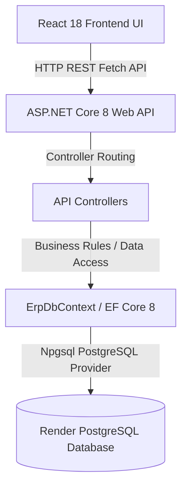

# ERP GOLDEN PATH & ARCHITECTURE GUIDELINES

> **Official Project-Wide Engineering Standard**  
> *Authoritative Guide for Development, Architecture, and Code Consistency*

---

## 1. CORE PRINCIPLE

> **"Follow the existing Golden Path before creating a new pattern."**

Any developer working on this project must inspect the existing codebase and follow the established architecture. When implementing a new feature or module:

1. **Find the closest existing feature** in the repository.
2. **Follow its folder structure** without creating arbitrary subdirectories.
3. **Follow its naming conventions** for files, classes, methods, and components.
4. **Follow its API structure** (RESTful endpoints, HTTP verbs, response schemas).
5. **Follow its validation approach** (frontend UX feedback + backend authoritative validation).
6. **Follow its error handling** (consistent HTTP status codes and user notifications).
7. **Follow its database approach** (Entity Framework Core + PostgreSQL).
8. **Follow its frontend state/data flow** (React Context API + REST async fetchers).
9. **Reuse existing utilities/services/components** (`Button`, `Input`, `Select`, `Icon`, `Drawer`, `StatusBadge`, `useERP`).
10. **Do not introduce a competing pattern** (e.g. Redux, GraphQL, Dapper, Axios) without an explicit, documented architectural requirement approved by the lead architect.

---

## 2. SYSTEM ARCHITECTURE

The application architecture follows a multi-tier client-server pattern:



### Component Layering & Responsibilities

- **Frontend Tier (`src/`)**: Built with React 18, Tailwind CSS, and Lucide Icons. Manages UI layout, client-side validation, and context state (`ERPContext.jsx`). Communicates with backend endpoints via native `fetch` requests.
- **Backend API Tier (`backend/`)**: ASP.NET Core 8 Web API. Hosts API controllers (`AuthController`, `PartiesController`, `ProductsController`, `PurchaseOrdersController`, `SalesInvoicesController`, `MastersController`, etc.).
- **Data Access Tier (`backend/Data/ErpDbContext.cs`)**: Entity Framework Core 8 Object-Relational Mapper (ORM).
- **Database Tier**: Render PostgreSQL relational database. PostgreSQL is the **sole source of truth** for all persistent business data.

---

## 3. BACKEND GOLDEN PATH

The preferred backend execution flow for every HTTP request is strictly layered:

```
HTTP Request 
    ↓
ASP.NET Core Controller (Routing & Action Execution)
    ↓
Request Binding & DTO / Model Validation
    ↓
Service / Business Domain Layer
    ↓
EF Core DbContext / Data Access Layer
    ↓
PostgreSQL Relational Storage
    ↓
Entity → Response DTO Mapping
    ↓
HTTP Action Result (200 OK / 201 Created / 400 BadRequest / 404 NotFound)
```

### Thin Controller Rule
Controllers **MUST REMAIN THIN**. Controllers must NOT contain:
- Complex business logic or calculations
- Direct multi-table complex raw queries
- Duplicated validation routines
- Hardcoded transaction state transitions
- Unrelated responsibilities (e.g., direct file system or external API manipulation)

**Controllers should primarily:**
1. Receive incoming HTTP requests and bind payload DTOs.
2. Trigger model/DTO validation checks.
3. Delegate core business processing to services or DbContext actions.
4. Return standard ASP.NET Core `IActionResult` responses (`Ok()`, `CreatedAtAction()`, `BadRequest()`, `NotFound()`, `NoContent()`).

---

## 4. DTO RULES

Data Transfer Objects (DTOs) enforce clear boundaries between internal database schemas and external API contracts.

### DTO Conventions
- **Naming Standard**: Use explicit suffixes for intent:
  - `Create[Entity]Dto` / `RegisterRequest` for creation payloads.
  - `Update[Entity]Dto` for edit payloads.
  - `[Entity]ResponseDto` / `AuthResponse` for API response payloads.
- **When to Use DTOs**:
  - Always use DTOs for Authentication operations (`RegisterRequest`, `LoginRequest`, `AuthResponse`).
  - Use DTOs when API payloads differ from DB schema properties (e.g. omitting `PasswordHash` or audit timestamps).
  - Use DTOs when accepting partial updates (`PUT`/`PATCH`).
- **Entity Exposure**: Standard database entities (`Party`, `Product`, `PurchaseOrder`, `SalesInvoice`) may be returned directly for standard CRUD operations provided no sensitive internal fields (e.g., password hashes, internal secret tokens) are exposed.

---

## 5. SERVICE RULES

All business logic belongs in the service or business domain layer.

### Service Responsibilities
- **Duplicate Checking**: Verification of unique constraint fields (e.g. duplicate GSTIN, duplicate Email, duplicate Item Code).
- **Business Validation**: Validating tax calculations, credit limits, discount caps, and status prerequisites.
- **Reference Protection**: Ensuring master records referenced in active Purchase Orders or Sales Invoices are not hard-deleted.
- **Transaction Rules**: Managing stock FIFO batch creation, inventory deductions, and ledger balances.
- **Status Transitions**: Moving transaction documents cleanly through their lifecycle (`Draft` $\rightarrow$ `Submitted` $\rightarrow$ `Approved` / `Rejected`).

### Prohibitions for Services
- Services MUST NOT import or reference `Microsoft.AspNetCore.Mvc` types (e.g. `IActionResult`, `ControllerBase`).
- Services MUST NOT inspect raw HTTP Request headers or response streams directly.

---

## 6. DATABASE RULES

PostgreSQL is the **sole authoritative source of truth** for all business data.

### Database Guidelines
1. **Zero Hardcoded Business Data**: Business data (parties, products, invoices, purchase orders) must never be hardcoded into frontend scripts or static backend initialization methods.
2. **No LocalStorage Database Misuse**: `localStorage` is permitted only for transient UI preferences (e.g. sidebar collapse state, auth token cache). It must NOT serve as a permanent database.
3. **Single DbContext**: All database entities must be registered in `ErpDbContext.cs`. Do not create secondary DbContexts.
4. **Schema Migrations**: Database schema modifications must be executed via EF Core migrations (`dotnet ef migrations add`).
5. **Foreign Key Integrity**: Enforce foreign keys across relational entities (`SalesInvoiceItem.ProductId` $\rightarrow$ `Product.Id`, `PurchaseOrder.PartyId` $\rightarrow$ `Party.Id`).
6. **Historical ERP Data Protection**: Master records (Customers, Suppliers, Items, Warehouses) referenced by historical transactions **MUST NEVER** be hard-deleted. If a record has dependent transactions, soft-deactivate it (`Status = "Inactive"`).

---

## 7. MASTER GOLDEN PATH

Every master screen in the ERP (Customer, Supplier, Item/Product, Category, UOM, Warehouse, Brand, HSN, Tax Rate, State, UQC, Payment Term, Employee, Groups) follows a uniform architecture:

```
Master View UI (`src/views/MastersView.jsx`)
    ↓
Context Helper Function (`addUom`, `updateParty`, `deactivateProduct`)
    ↓
HTTP Fetch Request (`POST /api/masters/uoms`, `PUT /api/parties/{id}`)
    ↓
ASP.NET Controller (`MastersController`, `PartiesController`, `ProductsController`)
    ↓
EF Core / PostgreSQL Persistence
```

### Standard Master CRUD Operations
- **CREATE (`POST`)**: React Modal Form $\rightarrow$ Validate required fields $\rightarrow$ `POST /api/...` $\rightarrow$ Database insertion $\rightarrow$ UI Toast notification.
- **READ (`GET`)**: Component mount / API sync $\rightarrow$ `GET /api/...` $\rightarrow$ Populate React state $\rightarrow$ Render data table.
- **UPDATE (`PUT`)**: Edit Modal $\rightarrow$ `PUT /api/.../{id}` $\rightarrow$ Update entity fields $\rightarrow$ Return updated record $\rightarrow$ UI refresh.
- **DELETE / DEACTIVATE (`DELETE`)**: Deletion Guard (`isMasterInUse`) $\rightarrow$ If safe: `DELETE /api/.../{id}` $\rightarrow$ Hard delete in DB. If referenced: `PUT /api/.../{id}` $\rightarrow$ Set `Status = "Inactive"`.

---

## 8. TRANSACTION GOLDEN PATH

Transactions (Purchase Orders, GRNs, Sales Invoices) coordinate master data and stock ledgers:

```
Party Master (Supplier / Customer) ──┐
                                     ├──> Transaction Document (PO / Sales Invoice)
Product Master (Items / Stock) ──────┘           ↓
                                        PostgreSQL Persistence
                                                 ↓
                                        Inventory Ledger & Batch Update
```

### Transaction Guidelines
1. **Master Referencing**: Transactions must reference valid `PartyId` and `ProductId` entries from PostgreSQL.
2. **Immutable Transaction History**: Once a Purchase Order is received (GRN) or a Sales Invoice is approved, line items and pricing become locked to preserve historical financial accuracy.
3. **Audit Fields**: Every transaction entity must track audit fields (`CreatedBy`, `CreatedDate`, `ModifiedBy`, `ModifiedDate`, `ApprovedBy`, `ApprovedDate`).

---

## 9. FRONTEND GOLDEN PATH

The React frontend follows a functional, component-based data flow:

```
Page View (`src/views/PurchasesView.jsx`)
    ↓
UI Component Library (`src/components/Input.jsx`, `Button.jsx`, `Select.jsx`)
    ↓
Centralized Context Hook (`useERP()` from `src/context/ERPContext.jsx`)
    ↓
Native `fetch` API Client
    ↓
ASP.NET Core REST Endpoint
```

### Frontend Rules
- React components MUST NOT contain direct database queries or raw SQL logic.
- React components MUST NOT hardcode mock business entities to replace missing backend data.
- Component state must cleanly support four standard states:
  1. **Loading State**: Visual spinners / skeleton loaders during async API requests.
  2. **Success State**: Clean rendering of database records.
  3. **Empty State**: Explicit user guidance when 0 records exist in PostgreSQL.
  4. **Error State**: Non-intrusive Toast alert describing backend validation or network issues.

---

## 10. STATE MANAGEMENT

State management is structured into distinct scopes to prevent data duplication:

| State Scope | Location / Pattern | Purpose / Examples |
| :--- | :--- | :--- |
| **Server Data** | `ERPContext.jsx` (`state`) | Authoritative database state fetched from ASP.NET API (`parties`, `products`, `purchaseOrders`, `salesInvoices`). |
| **UI State** | Component `useState` | Tab selection (`activeTab`), drawer toggles (`isGRNDrawerOpen`), modal visibility. |
| **Form State** | Local `useState` | Transient form field inputs (`poSupplierId`, `newProdName`, `email`, `password`). |
| **Auth State** | `ERPContext.jsx` (`currentUser`) | Currently logged-in user profile, role, company name, and JWT session token. |
| **Temporary State** | `CommandPalette.jsx` / `ToastContainer.jsx` | Quick search query results and transient Toast notification queues. |

---

## 11. ERROR HANDLING

### HTTP Status Code Standards
- **`400 Bad Request`**: Validation failures (e.g. missing required fields, invalid GSTIN format).
- **`401 Unauthorized`**: Authentication failures (e.g. incorrect password, missing/expired token).
- **`403 Forbidden`**: Role authorization restriction.
- **`404 Not Found`**: Requesting a non-existent entity ID.
- **`409 Conflict`**: Duplicate key or constraint violation (e.g. duplicate email or product code).
- **`500 Internal Server Error`**: Unexpected server-side exceptions.

### User Notification Rule
- The frontend must capture API error responses and display user-friendly Toast alerts via `showToast(title, message, 'error')`.
- **Never display a success toast if the underlying API call fails.**
- **Never replace failed API requests with fake fallback records.**

---

## 12. VALIDATION

Validation is enforced in two complementary layers:

### Frontend Validation (UX Feedback)
- Handled in React form submit handlers before API dispatch.
- Checks required field presence, minimum password length, and basic regex formats (e.g. GSTIN 15-character structure).
- Provides immediate visual feedback to the user without unnecessary network roundtrips.

### Backend Validation (Authoritative Security)
- Handled in ASP.NET Core controllers and service logic.
- Enforces strict data integrity, duplicate checks against database records, foreign key validation, and security sanitization.
- **Backend validation MUST NEVER be skipped under the assumption that frontend validation passed.**

---

## 13. AUTHENTICATION & AUTHORIZATION

Authentication follows a secure token-based user creation flow:

```
Register Form (`RegisterView.jsx`) ──> `POST /api/auth/register`
                                             ↓
                                   SHA-256 Salted Password Hash
                                             ↓
                                   PostgreSQL `Users` Table Insertion
                                             ↓
                                   Return `AuthResponse` + Bearer Token
```

### Auth Guidelines
- All user registration records include `FullName`, `CompanyName`, `Email`, `PasswordHash`, and `Role`.
- Passwords are salted and hashed server-side using SHA-256 (`PRIME_ERP_SALT_2026`).
- Session tokens are stored in browser `localStorage` (`PRIME_ERP_USER` and `PRIME_ERP_TOKEN`).
- Role-based permissions (`Store Manager`, `Inventory Admin`, `Sales Executive`, `Purchasing Agent`) govern accessible UI workflows.

---

## 14. SECURITY

### Mandatory Security Guidelines
1. **Secrets Management**: Never commit connection strings, passwords, or secret keys to source control.
2. **Environment Variables**: Database connection details must be loaded via `DATABASE_URL` or `appsettings.json` configuration variables.
3. **No Database Credentials in React**: The frontend must never have direct credentials to PostgreSQL.
4. **Parameterized Queries**: All database queries must use EF Core LINQ methods (`FirstOrDefaultAsync`, `ToListAsync`) to prevent SQL injection.
5. **Backend Authorization**: Verify user role claims server-side for sensitive operations.

---

## 15. NAMING CONVENTIONS

| Asset Type | Convention | Example |
| :--- | :--- | :--- |
| **C# Classes / Entities** | PascalCase | `PurchaseOrder`, `HsnSacMaster`, `Party` |
| **C# Controllers** | PascalCase + `Controller` | `PartiesController`, `ProductsController` |
| **C# Methods** | PascalCase | `GetById()`, `CreateParty()`, `SaveChangesAsync()` |
| **C# Variables / Fields** | camelCase / `_` prefix | `_db`, `existingParty`, `totalAmount` |
| **React Components** | PascalCase `.jsx` | `DashboardView.jsx`, `AppShell.jsx`, `Button.jsx` |
| **React Hooks / Helpers** | camelCase | `useERP()`, `calculateGSTTax()`, `showToast()` |
| **API Endpoints** | kebab-case plural | `/api/parties`, `/api/products`, `/api/masters/tax-rates` |
| **Database Tables** | PascalCase plural | `Parties`, `Products`, `PurchaseOrders`, `Users` |

---

## 16. FOLDER STRUCTURE

```
f:\ERP\
├── backend/                        # ASP.NET Core 8 Web API Project
│   ├── Controllers/                # Thin API Controllers
│   │   ├── AuthController.cs
│   │   ├── PartiesController.cs
│   │   ├── ProductsController.cs
│   │   ├── PurchaseOrdersController.cs
│   │   ├── SalesInvoicesController.cs
│   │   └── MastersController.cs
│   ├── Data/                       # Entity Framework Core Data Layer
│   │   └── ErpDbContext.cs
│   ├── Models/                     # C# Domain Entities & DTOs
│   │   ├── Party.cs
│   │   ├── Product.cs
│   │   ├── PurchaseOrder.cs
│   │   ├── SalesInvoice.cs
│   │   ├── MasterEntities.cs
│   │   └── User.cs
│   ├── Program.cs                  # Web API Bootstrapper & CORS Setup
│   └── ErpBackend.csproj           # C# Project Dependencies
├── docs/                           # Project Architectural Documentation
│   └── ERP-GOLDEN-PATH.md          # Official Engineering Standard
├── src/                            # React 18 Frontend Application
│   ├── components/                 # Reusable UI Component Library
│   │   ├── AppShell.jsx
│   │   ├── Button.jsx
│   │   ├── Drawer.jsx
│   │   ├── Icon.jsx
│   │   ├── Input.jsx
│   │   └── Select.jsx
│   ├── context/                    # Centralized React State Management
│   │   ├── ERPContext.jsx          # ERP Provider, Reducer, & API Sync
│   │   └── ERPContext.js           # Module Export Re-exporter
│   ├── views/                      # Feature Page Views
│   │   ├── DashboardView.jsx
│   │   ├── InventoryView.jsx
│   │   ├── MastersView.jsx
│   │   ├── PurchasesView.jsx
│   │   ├── SalesView.jsx
│   │   ├── SettingsView.jsx
│   │   └── RegisterView.jsx
│   └── App.jsx                     # Root React Component & Tab Router
├── index.html                      # HTML5 Application Shell Entrypoint
└── README.md                       # Project Overview & Quick Start Guide
```

---

## 17. ADDING A NEW MASTER

Follow this 20-step checklist to implement a new ERP Master:

- [ ] **Step 1**: Inspect a similar existing master (e.g. `UomMaster` or `BrandMaster`).
- [ ] **Step 2**: Define the C# entity class in `backend/Models/MasterEntities.cs`.
- [ ] **Step 3**: Add the corresponding `DbSet<XxxMaster>` property in `backend/Data/ErpDbContext.cs`.
- [ ] **Step 4**: Verify database schema initialization (`db.Database.EnsureCreated()`).
- [ ] **Step 5**: Create payload DTOs if the API contract differs from entity properties.
- [ ] **Step 6**: Implement `GET /api/masters/xxx` action in `backend/Controllers/MastersController.cs`.
- [ ] **Step 7**: Implement `POST /api/masters/xxx` action with required-field validation.
- [ ] **Step 8**: Implement `PUT /api/masters/xxx/{id}` action for record editing.
- [ ] **Step 9**: Implement `DELETE /api/masters/xxx/{id}` action with reference dependency checks.
- [ ] **Step 10**: Verify backend compilation (`dotnet build`).
- [ ] **Step 11**: Add initial backend data fetcher in `ERPContext.jsx` (`useEffect`).
- [ ] **Step 12**: Add reducer case in `erpReducer` for state updates.
- [ ] **Step 13**: Add context helper function (`addXxx`, `updateXxx`, `deleteXxx`) triggering `fetch()`.
- [ ] **Step 14**: Include helper functions in `value` object exported by `ERPContext.Provider`.
- [ ] **Step 15**: Update master tab list and modal form in `src/views/MastersView.jsx`.
- [ ] **Step 16**: Test **CREATE** via UI modal form $\rightarrow$ Verify PostgreSQL record creation.
- [ ] **Step 17**: Test **READ** $\rightarrow$ Refresh browser and verify record persistence.
- [ ] **Step 18**: Test **UPDATE** $\rightarrow$ Verify edits persist after reload.
- [ ] **Step 19**: Test **DELETE / DEACTIVATE** $\rightarrow$ Verify reference guard prevents unsafe deletion.
- [ ] **Step 20**: Verify 0 console errors during execution.

---

## 18. ADDING A NEW TRANSACTION

Follow this checklist to implement a new ERP Transaction document (e.g. Goods Receipt Note, Stock Transfer, Payment Voucher):

- [ ] **Step 1**: Inspect an existing transaction implementation (`PurchaseOrdersController.cs` or `SalesInvoicesController.cs`).
- [ ] **Step 2**: Create transaction header and detail item C# entity classes in `backend/Models/`.
- [ ] **Step 3**: Register DbSets in `ErpDbContext.cs`.
- [ ] **Step 4**: Implement REST controller endpoints (`GET`, `POST`, `PUT` status update).
- [ ] **Step 5**: Enforce mandatory master key validation (`PartyId`, `ProductId`, `WarehouseId`).
- [ ] **Step 6**: Add stock ledger transaction rules (FIFO batch allocation or stock deduction).
- [ ] **Step 7**: Add Context reducer cases and async API dispatch helpers in `ERPContext.jsx`.
- [ ] **Step 8**: Build workspace UI view (`Overview`, `Items`, `Action Drawer`).
- [ ] **Step 9**: Test document creation $\rightarrow$ Verify header and line items persist in PostgreSQL.
- [ ] **Step 10**: Verify stock ledger and audit stream update in real time.

---

## 19. NO NEW PATTERNS WITHOUT A REASON

Before introducing new third-party libraries, state managers, ORMs, or routing frameworks:

1. **Verify if the existing Golden Path already solves the problem.**
2. **Consult with the lead developer/architect.**
3. **Prefer consistency over novelty.** A unified codebase is exponentially easier to maintain and scale.

---

## 20. CODE REVIEW CHECKLIST

Developers must run through this checklist before submitting a pull request:

### Architecture & Consistency
- [ ] Follows the established ERP Golden Path.
- [ ] Reuses existing UI components (`Button`, `Input`, `Select`, `Icon`, `Drawer`).
- [ ] No competing libraries or duplicate architectures introduced.

### Backend
- [ ] Controller actions remain thin.
- [ ] Required fields, unique constraints, and business rules are validated server-side.
- [ ] Correct HTTP status codes returned (`200`, `201`, `400`, `404`, `500`).

### Database
- [ ] Entities registered in `ErpDbContext.cs`.
- [ ] Zero hardcoded business seed data.
- [ ] Foreign keys and reference protection enforced.

### Frontend
- [ ] Communicates via native `fetch` requests to ASP.NET API endpoints.
- [ ] Displays accurate loading, success, empty, and error states.
- [ ] Success toasts only displayed upon confirmed HTTP success.

### Security & Build
- [ ] Zero hardcoded secrets, connection strings, or credentials committed.
- [ ] Backend build succeeds with 0 compilation errors (`dotnet build`).

---

## 21. DEVELOPER DECISION RULE

> **"When you need to implement something new, do not start by designing your own solution.**  
> **First find the closest existing implementation in the codebase.**  
> **Understand why it is structured that way.**  
> **Then follow the exact same Golden Path."**

---

## 22. EXISTING DEVIATIONS / TECHNICAL DEBT

| Deviation / Technical Debt Item | Current Pattern | Golden Path Standard Pattern | Cleanup Recommendation & Priority |
| :--- | :--- | :--- | :--- |
| **1. Dual `.jsx` and `.js` Shell Wrappers** | Components exist as duplicate `.jsx` and `.js` files (e.g. `AppShell.jsx` vs `AppShell.js`). | Standardize 100% of React components on `.jsx` extension. | **Medium Priority**: Consolidate `.js` component wrappers into single `.jsx` files. |
| **2. Mixed Controller Structure** | Master CRUD is split between single-entity controllers (`PartiesController.cs`, `ProductsController.cs`) and multi-master controller (`MastersController.cs`). | Group related sub-masters cleanly while maintaining consistent REST URL patterns (`/api/masters/*`). | **Low Priority**: Retain current thin controller routes as documented to preserve API client compatibility. |
| **3. Master Item Code Fallbacks** | Frontend auto-generates string IDs (`UOM-01`, `BRD-01`) if database primary key is unavailable. | Rely on database auto-incrementing IDs (`id`) mapped from PostgreSQL. | **Low Priority**: Continue returning `dbId` along with formatted business codes. |

---
*ERP Golden Path & Architecture Guidelines — Official Project Standard*
